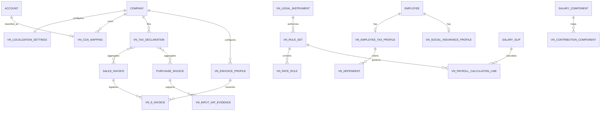
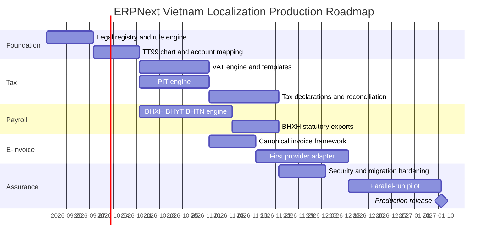

# Vietnam Localization Custom App for ERPNext

## Executive summary

A Vietnam localization app for ERPNext is technically very feasible, and the clean architecture is **one independent Frappe app layered on top of ERPNext + HRMS, with no fork of Frappe/ERPNext core**. Frappe explicitly supports DocType metadata, Custom Fields and lifecycle hooks such as `validate`, `on_submit` and `on_cancel`, while ERPNext already supplies the accounting, tax-template, payroll and General Ledger primitives needed underneath the Vietnam-specific logic. The most important architectural conclusion is that **Vietnamese law must not be encoded as constants scattered through Python code**. The app should contain an effective-dated legal rule registry. Every VAT rate, PIT bracket, family deduction, insurance contribution rate, wage ceiling, declaration schema and e-invoice schema should point to a legal instrument and an effective period. This matters especially now: Vietnam introduced a new VAT framework from July 2025, a new PIT law applicable to the 2026 tax period, a new enterprise accounting regime from January 2026, and a new tax-administration/e-invoice framework from July 2026. For a production v1, I would prioritize the implementation in this order:

**Vietnam Chart of Accounts → VAT → payroll BHXH/BHYT/BHTN → PIT → statutory export/reporting → one e-invoice adapter → additional invoice providers.**

That ordering gives usable accounting/payroll first and keeps the most provider-dependent component—e-invoicing—behind an adapter boundary.

As of **6 September 2026**, the most important current values for a normal resident employee/business implementation are:

| Area | Production baseline |
|---|---|
| VAT | 0%, 5%, 10%, non-taxable treatment; temporary **8%** for eligible goods/services that would otherwise be 10%, through **31 Dec 2026**. |
| Resident PIT on salary/wages | Five progressive monthly brackets: 5%, 10%, 20%, 30%, 35%. |
| PIT personal deduction | VND **15.5m/month** taxpayer; **6.2m/month/dependent** for tax period 2026. |
| Employee ordinary compulsory contributions | BHXH 8% + BHYT 1.5% + BHTN 1% = **10.5%**. |
| Employer ordinary contributions | BHXH 17% + BHYT 3% + BHTN 1%, plus ordinarily 0.5% occupational accident/disease insurance = **21.5%** in the ordinary case. Special/reduced categories must remain configurable. |
| Current reference level | VND **2.53m/month from 1 Jul 2026**; where the statutory ceiling is 20× that level, the ceiling is VND **50.6m/month**. |
| Accounting regime | Circular **99/2025/TT-BTC**, effective **1 Jan 2026**, is the new general enterprise accounting regime replacing Circular 200. |
| E-invoices | Current principal implementation layer is **Decree 254/2026/ND-CP + Circular 91/2026/TT-BTC**, effective **1 Jul 2026**. |

This should be treated as an engineering specification, not a substitute for final sign-off by a Vietnamese accountant/tax/payroll practitioner before a release is labelled legally compliant.

## Legal baseline and source priority

### Sources that should drive the rule engine

The app should rank legal references in roughly this order: **National Assembly law/resolution → Government decree → Ministry of Finance circular → Cục Thuế/BHXH Vietnam official technical procedure → provider implementation specification**. Provider documentation should never be allowed to override a statutory rule.

The following is the prioritized document set I would put into the app's initial `VN Legal Instrument` fixtures.

| Priority | Instrument | Official source / link | Effective date | What the app needs from it |
|---|---|---|---|---|
| P0 | **Law 48/2024/QH15 – VAT Law** | Government legal database: `https://vanban.chinhphu.vn/?classid=1&docid=212476&orggroupid=1&pageid=27160` | 1 Jul 2025 | VAT scope, taxable/non-taxable treatment, rates, input/output VAT principles. |
| P0 | **Decree 181/2025/ND-CP** | `https://vanban.chinhphu.vn/?docid=214336&pageid=27160` | 1 Jul 2025 | Detailed VAT implementation and deduction conditions. |
| P0 | **Circular 69/2025/TT-BTC** | `https://vanban.chinhphu.vn/?docid=214417&pageid=27160` | 1 Jul 2025 | MOF-level VAT implementation details. |
| P0 | **Resolution 204/2025/QH15 + Decree 174/2025/ND-CP** | Government legal database. | 1 Jul 2025 | Temporary 8% VAT treatment through 31 Dec 2026 and exclusion classes. |
| P0 | **Decrees 359/2025 and 144/2026 amending Decree 181** | Government legal database. | 2026 amendments | Version VAT deduction/payment-evidence rules rather than embedding the original 2025 implementation forever. |
| P0 | **Law 109/2025/QH15 – Personal Income Tax** | `https://vanban.chinhphu.vn/?classid=1&docid=216495&pageid=27160&typegroupid=3` | 1 Jul 2026; salary/wage provisions apply to tax period 2026 | PIT income classification, deductions, progressive schedule, exemptions. |
| P0 | **Law 09/2026/QH16** | Government legal database. | 24 Apr 2026 | Amendment layer affecting PIT/VAT and other taxes; must be represented as a legal amendment rather than overwriting historical rules. |
| P0 | **Circular 89/2026/TT-BTC** | `https://vanban.chinhphu.vn/?classid=1&docid=218974&orggroupid=4&pageid=27160` | 1 Jul 2026 | Current tax-administration declarations/forms and export schema baseline. |
| P0 | **Law 41/2024/QH15 – Social Insurance Law** | `https://vanban.chinhphu.vn/?docid=211199&pageid=27160` | 1 Jul 2025 | Compulsory BHXH subjects, contribution basis, employee/employer shares and ceilings. |
| P0 | **Decree 158/2025/ND-CP** | `https://vanban.chinhphu.vn/?docid=214189&pageid=27160` | 1 Jul 2025 | Detailed compulsory BHXH implementation. |
| P0 | **Decree 188/2025/ND-CP – Health Insurance** | `https://vanban.chinhphu.vn/?docid=214515&pageid=27160` | 15 Aug 2025 | BHYT contribution and administration rules. |
| P0 | **Law 74/2025/QH15 – Employment Law** | Government legal database. | 1 Jan 2026 | BHTN legal basis and contribution ceiling. |
| P0 | **Decree 374/2025/ND-CP** | Government legal database. | 1 Jan 2026 | Current unemployment-insurance implementation, including 1% employee / 1% employer ordinary contribution. |
| P0 | **Circular 99/2025/TT-BTC – Enterprise Accounting Regime** | Ministry of Finance official guidance. | 1 Jan 2026 | Official enterprise account system, vouchers, ledgers and financial statements. |
| P0 | **Law 88/2015/QH13 – Accounting Law** | `https://vanban.chinhphu.vn/default.aspx?docid=183198&pageid=27160` | 1 Jan 2017 | Accounting evidence, books, record retention and auditability. |
| P0 | **Decree 254/2026/ND-CP – electronic invoices/documents** | `https://vanban.chinhphu.vn/?docid=218689&pageid=27160` | 1 Jul 2026 | Current e-invoice legal framework under the new Tax Administration Law. |
| P0 | **Circular 91/2026/TT-BTC** | `https://vanban.chinhphu.vn/?classid=1&docid=219006&orggroupid=4&pageid=27160` | 1 Jul 2026 | Current electronic invoice/document implementation and XML/data requirements. |
| P1 | **Decisions 1450/QD-TCT and 1510/QD-TCT** | Cục Thuế official publications. | Earlier HĐĐT technical regime | Useful technical lineage for invoice data components/transmission. Do **not** assume every old schema remains current after Circular 91; schema-version the adapter. |
| P0 | **BHXH Decision 490/QD-BHXH and current administrative procedure** | BHXH Vietnam. | Current procedure lineage | TK1-TS, TK3-TS, D02-LT and participation/change-report workflows. |
| P0 | **Law 91/2025/QH15 – Personal Data Protection** | `https://vanban.chinhphu.vn/?classid=1&docid=214590&pageid=27160&typegroupid=3` | 1 Jan 2026 | Protection of employee/customer personal data. |
| P0 | **Decree 356/2025/ND-CP** | `https://vanban.chinhphu.vn/?docid=216387&pageid=27160` | 1 Jan 2026 | Detailed implementation of the Personal Data Protection Law. |

Two implementation consequences follow from this table.

First, the app needs a `legal_reference` field on **every rule set**, not merely a README saying “according to Vietnamese law.” Second, amendments must be additive. A VAT rule effective 2025 must remain available to reproduce a 2025 invoice after the app is upgraded in 2027.

### Official sources to monitor

For ongoing maintenance, monitor **`vanban.chinhphu.vn`**, the **Ministry of Finance**, **Cục Thuế/GDT**, and **BHXH Vietnam** first. Cục Thuế is especially important for operational tax filing and e-invoice technical changes; for example its 2026 publications confirm the transition to Circular 91 for e-invoices and Circular 89 for tax administration. BHXH Vietnam should be treated as the operational source for enrollment/change forms and contribution procedures. Its current administrative procedure explicitly requires, for employers as applicable, `TK3-TS`, `D02-LT`, and employee `TK1-TS`. ## Tax, payroll and accounting rules to implement

### VAT

The data model needs **tax treatment**, not merely a numeric percentage. At minimum:

`NON_TAXABLE`, `ZERO_RATE_0`, `REDUCED_5`, `TEMP_REDUCED_8`, `STANDARD_10`.

A zero-rated transaction and a non-taxable transaction are legally/accountingly different and must not collapse into the same `0.00%` tax template.

Vietnam's current VAT framework has statutory rates of 0%, 5% and 10%; in addition, eligible goods/services normally subject to 10% receive a temporary reduction to **8% through 31 December 2026**. The current reduction excludes specified groups including telecommunications, finance/banking/securities/insurance, real estate, certain metals/mining products and certain excise goods/services. Therefore never implement:

```python
if posting_date.year == 2026:
    vat = 8
```

Instead use an effective-dated classification:

```text
Item/Service
    -> VN VAT Classification
        -> statutory base rate
        -> reduction eligibility
        -> exclusion code
        -> legal rule
        -> effective_from/effective_to
```

For the credit/deduction method, the app needs to separate **output VAT liability** from **deductible input VAT**, and capture the evidence needed to determine input-VAT eligibility. Current VAT law/decrees regulate deduction conditions and later 2026 amendments changed parts of the implementation, which is precisely why evidence/payment conditions should sit in the rule engine. Recommended Purchase Invoice fields:

```text
vn_input_vat_status:
    Eligible
    Ineligible
    Partially Eligible
    Pending Evidence

vn_vat_invoice_number
vn_vat_invoice_date
vn_supplier_tax_id
vn_payment_evidence_status
vn_deductible_ratio
vn_legal_rule_version
```

Do **not** hard-code a monetary payment-evidence threshold without pinning it to an effective legal rule; that threshold is one of the details most likely to change.

ERPNext already supports Sales/Purchase Taxes and Charges Templates, Item Tax Templates, Tax Categories and Tax Rules. Item Tax Templates are particularly useful where different items on one invoice carry different VAT treatments. For current reporting, implement exports around the official **01/GTGT** return plus the applicable current attachments. Cục Thuế's 2026 HTKK material still references `01/GTGT`, including VAT-reduction attachments, and current guidance references Circular 89/2026. ### PIT / TNCN

The 2026 salary/wage engine should use the new Law 109 regime. For a resident individual, taxable salary/wage income is reduced by eligible compulsory insurance and statutory deductions before applying progressive PIT. Current official guidance also identifies compulsory BHXH/BHYT/BHTN among deductible items; nonresident salary/wage income attributable to work in Vietnam is generally taxed at 20%. The current resident monthly brackets are:

| Monthly assessable income after permitted deductions | Rate |
|---:|---:|
| Up to VND 10m | 5% |
| Over 10m to 30m | 10% |
| Over 30m to 60m | 20% |
| Over 60m to 100m | 30% |
| Over 100m | 35% |

These five brackets apply under the new regime for the 2026 tax period. Family deductions for 2026 are **VND 15.5m/month for the taxpayer and VND 6.2m/month for each eligible dependent**. Every Salary Component should therefore have VN-specific characteristics rather than relying only on whether ERPNext calls it an Earning or Deduction:

```text
vn_pit_taxable
vn_pit_exemption_code
vn_pit_taxable_ratio
vn_bhxh_base_included
vn_bhyt_base_included
vn_bhtn_base_included
vn_regular_stable_payment
vn_legal_rule
```

This allows, for example, one earning to be payroll income but legally excluded from a particular contribution base.

The exemption catalogue should likewise be data-driven. Law 109 contains exemptions and special treatments, but reproducing that entire statute as Python branches would make maintenance unnecessarily dangerous. For employer reporting, build the current **05/KK-TNCN** periodic declaration and **05/QTT-TNCN** annual finalization export. Cục Thuế's 2026 material confirms `05/QTT-TNCN` under Circular 89 and notes the 2026 transition of `05/KK-TNCN` to quarterly filing. One area I would deliberately mark **unspecified/configurable in the initial legal engine** is the exact threshold/conditions for flat withholding on every category of short-term/non-labour-contract payment under the post-Law-109 implementation. Older/current GDT material continues to refer to 10% withholding in relevant cases, but production code should not infer that every historical threshold survived unchanged without validation against the applicable 2026 implementing instrument. ### BHXH, BHYT, BHTN and occupational insurance

For an ordinary employee subject to the standard schemes, the base configuration should decompose the contribution rather than store a single `32%` rate.

| Fund | Employee | Employer | App code |
|---|---:|---:|---|
| BHXH – retirement/survivorship etc. | 8% | 17% aggregate employer BHXH obligations | `BHXH_EE`, `BHXH_ER` |
| BHYT | 1.5% | 3% | `BHYT_EE`, `BHYT_ER` |
| BHTN | 1% | 1% | `BHTN_EE`, `BHTN_ER` |
| BHTNLĐ-BNN | 0% | ordinarily 0.5% | `OAI_ER` |
| **Ordinary total** | **10.5%** | **21.5%** | |

The BHXH Law provides the ordinary employee 8% retirement/survivorship contribution and the employer-side BHXH components including 3% sickness/maternity and 14% retirement/survivorship. BHYT is currently 4.5%, split 3% employer and 1.5% employee. Current BHTN implementation uses 1% employee and 1% employer. BHXH Vietnam material describes the ordinary occupational accident/disease contribution as an additional employer 0.5%; special/reduced-rate cases should therefore be a separate rule rather than merged permanently into `BHXH_ER`. The **contribution base is not necessarily gross pay**. The app needs to classify salary, allowances and other regular payments according to the applicable insurance rules. The Social Insurance Law/Decree 158 framework defines the wage basis and statutory minimum/maximum constraints. As of 1 July 2026, BHXH Vietnam publications state that the reference level is **VND 2.53m/month**. Where a rule uses the 20-times-reference-level ceiling, that means a current cap of **VND 50.6m/month**. BHTN is different: its ceiling is tied to the applicable **regional minimum wage**, so the app needs an effective-dated `VN Wage Region` table rather than borrowing the BHXH reference-level ceiling. The exact current region-by-region wage table is deliberately **not hard-coded in this report**; load it from the applicable wage decree as a separate legal dataset.

For BHXH administration, support at least:

- employee participation/change data corresponding to `TK1-TS`;
- employer registration/change data corresponding to `TK3-TS`;
- employee utilization/participation list corresponding to `D02-LT`.

Those are listed in BHXH Vietnam's current administrative procedure. Provider-specific electronic transaction/service codes are **unspecified** here because those can belong to the BHXH portal/eBHXH provider transport layer rather than the substantive payroll rule.

### Vietnam Chart of Accounts

For 2026, the default general-enterprise profile should be built from **Appendix II of Circular 99/2025/TT-BTC**, not from an old Circular 200 chart copied from another implementation. Circular 99 took effect on 1 January 2026 and replaced the previous general-enterprise Circular 200 regime. ERPNext already has a country-wise Chart of Accounts mechanism using hierarchical JSON, so a Vietnam template can be delivered as a fixture/template instead of modifying accounting core. The design should separate **statutory account identity** from the ERPNext account's display name:

```text
Account
  account_name = "Thuế GTGT đầu ra"
  vn_statutory_code = "33311"
  vn_statutory_role = "OUTPUT_VAT"
  accounting_regime = "TT99-2025"
```

For example, Appendix II identifies `3331` as VAT payable and `33311` as output VAT. For implementation, the following mapping is useful, but account numbers marked with `*` should be validated directly against the imported Appendix II for the selected accounting regime before production rather than being treated as code constants:

| Statutory role | Typical VN account | ERPNext mapping |
|---|---|---|
| Deductible input VAT | `1331*` | Current Asset, tax account used by Purchase Taxes and Charges Template |
| Output VAT payable | `33311` | Current Liability, Sales Taxes and Charges Template |
| Employee payable | `334*` | Payroll Payable |
| BHXH payable | `3383*` | Current Liability |
| BHYT payable | `3384*` | Current Liability |
| BHTN payable | `3386*` | Current Liability |
| PIT payable | appropriate tax-payable subaccount under `333*` | Current Liability |
| Trade receivable | `131*` | Receivable |
| Trade payable | `331*` | Payable |
| Revenue | `511*` family | Income |

The important point is **not** that Python knows `"33311"`. The rule is:

```python
account = get_account_by_statutory_role(
    company=company,
    role="OUTPUT_VAT",
    accounting_regime="TT99-2025",
)
```

That also permits a future TT99 amendment, a special sector account structure, or a validated SME accounting profile without rewriting VAT logic.

Circular 133/2016 remains an official SME accounting document in the government repository. I would ship a TT99 profile first and treat a TT133 profile as a separate optional template whose 2026 applicability to the specific client is confirmed by an accountant rather than silently selecting it based only on company size.

## ERPNext data model and accounting design

### Recommended DocTypes

The app could be named `erpnext_vietnam` with module boundaries such as `Legal`, `Tax`, `Payroll Compliance`, `E-Invoice`, `Declarations`, and `Accounting Localization`.

The central model should look like this:



I would create these custom DocTypes:

**`VN Legal Instrument`** holds number, title, issuer, official URL, publication/effective/expiry dates and a copy/hash of the source used for implementation.

**`VN Rule Set` + `VN Rate Rule`** provide effective-dated formulas/rates and legal references.

**`VN Employee Tax Profile`** holds residency, tax identification, applicable withholding mode and dependent links.

**`VN Social Insurance Profile`** holds participation flags, BHXH identifier, applicable wage region, special contribution category and agency/unit information.

**`VN Contribution Component`** maps statutory contributions to ERPNext Salary Components and GL statutory roles.

**`VN Payroll Calculation Line`** creates an auditable snapshot of the exact rate, base, ceiling and legal rule used for a Salary Slip.

**`VN E-Invoice`** is a companion legal document linked to Sales Invoice, rather than putting 40 provider-specific fields directly onto ERPNext's Sales Invoice.

**`VN Tax Declaration`** represents `01/GTGT`, `05/KK-TNCN`, `05/QTT-TNCN`, future forms and their generated submission/export files.

**`VN COA Mapping`** maps statutory roles to actual ERPNext Accounts.

Frappe's DocType model is explicitly metadata-driven, while custom fields and event hooks are supported without changing core. ### Mapping Vietnam requirements to ERPNext

| Vietnam requirement | Standard ERPNext/HRMS object | VN additions |
|---|---|---|
| Company tax identity | `Company` | tax ID, tax authority, accounting regime, localization settings |
| Output VAT | `Sales Invoice`, `Sales Taxes and Charges Template`, `Item Tax Template` | VAT treatment code, legal rule, reduction eligibility, declaration mapping |
| Input VAT | `Purchase Invoice`, `Purchase Taxes and Charges Template` | deductible status, evidence/payment status, deduction ratio |
| VAT ledger | `Account`, GL Entry | `vn_statutory_role=INPUT_VAT/OUTPUT_VAT` |
| Employee PIT | `Employee`, `Salary Slip`, `Salary Component` | tax residency, tax ID, taxable/exempt flags, PIT calculation snapshot |
| Dependents | `Employee` + custom | `VN Dependent`, validity period, deduction eligibility |
| BHXH/BHYT/BHTN | `Salary Component`, `Salary Structure`, `Salary Slip` | contribution-base flags, employee/employer rates, caps and rule versions |
| Employer insurance expense | Payroll + `Journal Entry` | consolidated `VN Payroll Accrual` / employer contribution JE |
| BHXH reporting | `Employee`, payroll | TK1-TS/TK3-TS/D02-LT export layer. |
| PIT reporting | Salary Slips | 05/KK-TNCN and 05/QTT-TNCN export. |
| VAT reporting | Sales/Purchase invoices | 01/GTGT aggregation and current annex exports. |
| E-invoice | `Sales Invoice` | separate `VN E-Invoice` lifecycle + adapter |
| Vietnam COA | `Account`, Company COA template | statutory code/role and TT99 profile |
| Legal reproducibility | none | immutable `VN Rule Set` snapshot/reference |

ERPNext's tax templates can calculate tax on net total and support item-specific tax templates; Journal Entries post balanced debit/credit rows into the ledger. ### Example rule-set YAML

This is the sort of configuration I would ship as versioned fixture data:

```yaml
code: VN-2026-09
country: VN
currency: VND
effective_from: 2026-07-01

legal_references:
  - "48/2024/QH15"
  - "109/2025/QH15"
  - "41/2024/QH15"
  - "74/2025/QH15"
  - "174/2025/ND-CP"
  - "254/2026/ND-CP"
  - "89/2026/TT-BTC"
  - "91/2026/TT-BTC"
  - "99/2025/TT-BTC"

vat:
  standard_rate: 0.10
  reduced_rate: 0.05
  zero_rate: 0.00
  temporary_reduction:
    rate: 0.08
    effective_to: 2026-12-31
    eligibility: classification_required

pit:
  taxpayer_deduction_monthly: 15500000
  dependent_deduction_monthly: 6200000
  resident_monthly_brackets:
    - up_to: 10000000
      rate: 0.05
    - up_to: 30000000
      rate: 0.10
    - up_to: 60000000
      rate: 0.20
    - up_to: 100000000
      rate: 0.30
    - up_to: null
      rate: 0.35
  nonresident_salary_rate: 0.20

social_insurance:
  reference_level:
    amount: 2530000
    effective_from: 2026-07-01

  bhxh:
    employee_rate: 0.08
    employer_rate: 0.17
    ceiling_formula: "20 * reference_level"

  bhyt:
    employee_rate: 0.015
    employer_rate: 0.03

  bhtn:
    employee_rate: 0.01
    employer_rate: 0.01
    ceiling_formula: "20 * applicable_regional_minimum_wage"

  occupational_accident_disease:
    ordinary_employer_rate: 0.005
    allow_special_rate: true
```

The values shown correspond to the current official 2026 framework discussed above. ### Example Frappe DocType JSON

A provider-neutral e-invoice object could begin like this:

```json
{
  "doctype": "DocType",
  "name": "VN E-Invoice",
  "module": "Vietnam Localization",
  "is_submittable": 1,
  "track_changes": 1,
  "fields": [
    {
      "fieldname": "company",
      "label": "Company",
      "fieldtype": "Link",
      "options": "Company",
      "reqd": 1
    },
    {
      "fieldname": "sales_invoice",
      "label": "Sales Invoice",
      "fieldtype": "Link",
      "options": "Sales Invoice",
      "reqd": 1
    },
    {
      "fieldname": "provider",
      "label": "Provider",
      "fieldtype": "Link",
      "options": "VN E-Invoice Provider",
      "reqd": 1
    },
    {
      "fieldname": "invoice_type",
      "label": "Invoice Type",
      "fieldtype": "Select",
      "options": "VAT Invoice\nSales Invoice\nPOS E-Invoice"
    },
    {
      "fieldname": "tax_authority_code",
      "label": "Tax Authority Code",
      "fieldtype": "Data"
    },
    {
      "fieldname": "provider_invoice_id",
      "label": "Provider Invoice ID",
      "fieldtype": "Data"
    },
    {
      "fieldname": "schema_version",
      "label": "Schema Version",
      "fieldtype": "Data",
      "reqd": 1
    },
    {
      "fieldname": "legal_rule_set",
      "label": "Legal Rule Set",
      "fieldtype": "Link",
      "options": "VN Rule Set",
      "reqd": 1
    },
    {
      "fieldname": "signed_xml",
      "label": "Signed XML",
      "fieldtype": "Attach"
    },
    {
      "fieldname": "xml_sha256",
      "label": "XML SHA-256",
      "fieldtype": "Data",
      "read_only": 1
    },
    {
      "fieldname": "status",
      "label": "Status",
      "fieldtype": "Select",
      "options": "Draft\nQueued\nIssued\nAccepted\nRejected\nAdjusted\nReplaced\nCancelled",
      "read_only": 1
    }
  ]
}
```

### Hooks without changing core

Frappe officially supports `doc_events` for standard DocType lifecycle events, so the app does not need an ERPNext fork. ```python
# erpnext_vietnam/hooks.py

doc_events = {
    "Salary Slip": {
        "validate":
            "erpnext_vietnam.payroll.events.validate_vn_payroll",
        "on_submit":
            "erpnext_vietnam.payroll.events.snapshot_vn_calculation",
    },
    "Payroll Entry": {
        "on_submit":
            "erpnext_vietnam.payroll.events.create_employer_contribution_accrual",
    },
    "Sales Invoice": {
        "validate":
            "erpnext_vietnam.tax.events.validate_vat_treatment",
        "on_submit":
            "erpnext_vietnam.einvoice.events.queue_issue",
        "on_cancel":
            "erpnext_vietnam.einvoice.events.validate_legal_cancellation",
    },
    "Purchase Invoice": {
        "validate":
            "erpnext_vietnam.tax.events.validate_input_vat",
    },
}
```

I would strongly prefer hooks and companion DocTypes over `override_doctype_class` unless an upstream limitation makes an override unavoidable. That reduces upgrade coupling.

### Example payroll and VAT entries

Assume an ordinary resident employee earns **VND 30m/month**, the whole VND 30m is the insurance contribution base, there are no dependents or exempt earnings, and the employee is below all relevant ceilings.

Employee compulsory contributions are:

```text
BHXH  30,000,000 × 8%   = 2,400,000
BHYT  30,000,000 × 1.5% =   450,000
BHTN  30,000,000 × 1%   =   300,000
                             ----------
Total employee insurance   3,150,000
```

Current ordinary contribution rates are supported by the cited BHXH/BHYT/BHTN rules. PIT assessable income in this simplified example is:

```text
Gross salary                             30,000,000
Less employee compulsory insurance      (3,150,000)
Less taxpayer personal deduction        (15,500,000)
                                        ------------
Assessable income                         11,350,000
```

Using the current 5% / 10% first brackets:

```text
10,000,000 × 5% = 500,000
 1,350,000 × 10% = 135,000
PIT                 635,000
```

The brackets and VND 15.5m deduction are the current 2026 values. Employee net payable is therefore **VND 26.215m** in this deliberately simplified example.

Employer contributions are:

```text
BHXH       17.0% = 5,100,000
BHYT        3.0% =   900,000
BHTN        1.0% =   300,000
BHTNLĐ-BNN  0.5% =   150,000
                   -----------
Employer cost       6,450,000
```

An illustrative accrual is:

```text
Dr Salary Expense                         30,000,000
Dr Employer Statutory Contribution Exp.    6,450,000

    Cr Employee Payable                    26,215,000
    Cr BHXH/BHTNLĐ-BNN Payable              7,650,000
    Cr BHYT Payable                         1,350,000
    Cr BHTN Payable                           600,000
    Cr PIT Payable                            635,000
                                           ----------
                                           36,450,000
```

ERPNext's normal payroll accounting model already debits salary/benefit expense and credits payroll liabilities; the localization layer's task is to create the Vietnam statutory breakdown and correct account mappings. For a VND 100m taxable domestic sale at standard 10% VAT:

```text
Dr Accounts Receivable       110,000,000
    Cr Sales Revenue         100,000,000
    Cr Output VAT             10,000,000
```

For an eligible 8% transaction during the temporary reduction period:

```text
Dr Accounts Receivable       108,000,000
    Cr Sales Revenue         100,000,000
    Cr Output VAT              8,000,000
```

The temporary 8% treatment is effective only for eligible classifications and currently ends on 31 December 2026. For a VND 50m purchase plus fully deductible 10% input VAT:

```text
Dr Expense / Inventory        50,000,000
Dr Deductible Input VAT        5,000,000
    Cr Accounts Payable       55,000,000
```

**Issuing the electronic invoice must not create another accounting entry.** The ERPNext Sales Invoice has already generated the accounting event; `VN E-Invoice` is the statutory representation/transmission state of that commercial transaction. Adjustments/replacements should create accounting effects only where the underlying transaction legally/accountingly requires them.

## E-invoice and statutory integration architecture

Vietnam's e-invoice regime changed again in 2026. Circular 91/2026 implements the new Tax Administration framework and Decree 254/2026, both effective from 1 July 2026. Current Cục Thuế guidance specifically discusses standardized XML invoice data under Circular 91. That makes a **provider adapter architecture mandatory**.

```text
ERPNext Sales Invoice
        │
        ▼
VN E-Invoice
        │
        ▼
Canonical VN Invoice Model
        │
        ├── Adapter: VNPT
        ├── Adapter: Viettel
        ├── Adapter: MISA
        ├── Adapter: FPT
        ├── Adapter: BKAV
        └── Adapter: Direct Tax Authority / future gateway
                  │
                  ▼
        Provider / Cục Thuế
```

Provider names above illustrate likely adapter targets, not a claim that every named provider currently exposes the same API or certification model. Their current contractual/API specifications must be checked individually before implementation.

Define one Python protocol:

```python
from typing import Protocol

class VietnamEInvoiceAdapter(Protocol):
    def validate(self, invoice: dict) -> None: ...
    def issue(self, invoice: dict, idempotency_key: str) -> dict: ...
    def get_status(self, external_id: str) -> dict: ...
    def adjust(self, external_id: str, payload: dict) -> dict: ...
    def replace(self, external_id: str, payload: dict) -> dict: ...
    def cancel(self, external_id: str, reason: str) -> dict: ...
    def download_xml(self, external_id: str) -> bytes: ...
    def download_rendering(self, external_id: str) -> bytes: ...
```

Internally, ERPNext should generate a **canonical invoice object** independent of any vendor:

```json
{
  "schema": "VN-CANONICAL-2026-01",
  "seller": {
    "tax_id": "...",
    "legal_name": "..."
  },
  "buyer": {
    "tax_id": "...",
    "legal_name": "..."
  },
  "invoice_type": "VAT",
  "currency": "VND",
  "lines": [
    {
      "description": "Service A",
      "net_amount": 100000000,
      "vat_treatment": "STANDARD_10",
      "vat_rate": 0.10,
      "vat_amount": 10000000
    }
  ],
  "net_total": 100000000,
  "vat_total": 10000000,
  "grand_total": 110000000
}
```

The adapter translates this into the provider's schema.

Older Decisions 1450/QD-TCT and 1510/QD-TCT established technical data components/transmission conventions for the earlier national HĐĐT implementation. Because Circular 91 is now the current legal implementation layer, treat those decisions as **technical lineage**, not as an excuse to freeze an old XML schema forever.

The precise production endpoint, authentication handshake and provider certification conditions for direct transmission are **unspecified in the official sources reviewed** and may depend on whether the enterprise communicates via a licensed service provider or an authorized direct connection.

### Signing and immutable storage

The integration should store:

```text
Original canonical payload
Provider request ID
Provider invoice ID
Invoice number / symbol
Tax-authority code, where applicable
Schema version
Unsigned generated XML, if applicable
Final legally signed/accepted XML
SHA-256 hash of final XML
Signing certificate serial / metadata
Provider response
Tax-authority response/status
Adjustment/replacement/cancellation references
Human-readable PDF/rendering
```

The legal source artifact should be the final electronic data/XML rather than treating a PDF rendering as the authoritative invoice. Tax-authority guidance has long described the HĐĐT format as XML, and the current 2026 regime continues to standardize electronic invoice data. Private signing keys should **not** be stored as ordinary Frappe DocType fields. Prefer a hardware token, HSM, remote-signing service or provider signing service depending on the legally permitted provider workflow. The precise legally required signature mode varies by invoice type/workflow and should therefore be represented by provider/legal rules rather than a universal `"must_sign": true`.

Each operation needs an idempotency key, for example:

```text
VN-EINV:{company}:{sales_invoice}:{operation}:{revision}
```

A network timeout after the provider accepted an invoice must cause a **status reconciliation**, not blindly issue another invoice.

### Tax and BHXH exports

`VN Tax Declaration` should separate three concerns:

```text
calculation snapshot
        ↓
statutory declaration model
        ↓
format adapter
        ├── XML
        ├── HTKK-compatible export
        ├── XLSX/CSV reconciliation
        └── future direct eTax API
```

Current tax filing forms should include at least VAT `01/GTGT`, PIT `05/KK-TNCN` and annual `05/QTT-TNCN`. For BHXH, make `TK1-TS`, `TK3-TS` and `D02-LT` exporters independent of payroll calculation. BHXH Vietnam's current administrative procedure identifies these forms directly. This separation matters because changing a government XML/XLS format should not change how payroll is calculated.

## Versioning, migration, security and QA

### Legal rule versioning

Every calculation must be reproducible years later.

A `VN Rule Set` should therefore be immutable once marked `Released`:

```text
VN-2026-H1
valid_to = 2026-06-30

VN-2026-H2
valid_from = 2026-07-01

VN-2027-H1
valid_from = 2027-01-01
```

Submitted documents should store both:

```text
vn_rule_set = VN-2026-H2
vn_rule_snapshot_hash = ebd4...
```

Never recalculate old submitted Salary Slips or Sales Invoices merely because a current law/rate changed.

The temporary VAT reduction demonstrates why: the eligible 8% rule currently has an explicit end date of 31 December 2026. Likewise the reference level changed to VND 2.53m on 1 July 2026. A correct historical payroll calculation needs to know which side of those dates it belongs to.

Each legal rule should carry something like:

```json
{
  "rule_code": "PIT_PERSONAL_DEDUCTION",
  "value": 15500000,
  "unit": "VND/month",
  "effective_from": "2026-01-01",
  "effective_to": null,
  "legal_instruments": ["109/2025/QH15"],
  "status": "Released"
}
```

### Upgrade and rollback policy

The app should use normal Frappe patches/migrations but obey four restrictions:

**Never edit submitted historical transactions as part of a legal migration.**

**Never overwrite an old rule version.**

**Never make an external e-invoice call inside a schema migration.**

**Never make ERPNext core modifications a prerequisite for Vietnam localization.**

Before upgrades, capture:

```text
database backup
private/public files backup
site_config
installed app versions and git SHAs/tags
VN legal rule fixtures
provider adapter configuration, excluding raw secrets
e-invoice XML archive index
```

Deploy legal changes first in **shadow mode**: calculate both the old and candidate new rule set and report differences without posting GL or issuing invoices.

After acceptance, switch the company default rule set on an effective date.

Rollback means reverting the app tag/database migration while **preserving already-issued legal documents**. An e-invoice that has reached the provider/tax authority cannot be “rolled back” by restoring MariaDB; it requires the legal adjustment/replacement/cancellation workflow.

### Automated QA matrix

Frappe provides its own automated test tooling and dependency-aware DocType testing, so the localization should ship tests, not only fixtures. Minimum production test cases should include:

| Test family | Required boundaries |
|---|---|
| PIT brackets | exactly 10m; 10m+1; 30m; 60m; 100m assessable income |
| Family deductions | zero/one/multiple dependents; dependent effective mid-year |
| Resident/nonresident | progressive vs 20% resident-status path |
| Insurance | salary below/at/above contribution ceiling |
| Reference level | payroll on 30 Jun 2026 vs 1 Jul 2026 |
| BHTN | employees in different regional-wage areas |
| VAT | 0/5/8/10/non-taxable; 8% eligible and excluded classifications |
| VAT expiry | invoice on 31 Dec 2026 vs 1 Jan 2027 |
| Input VAT | eligible/ineligible/partial/pending evidence |
| GL | every transaction balances; statutory-control account totals reconcile |
| VAT declaration | `01/GTGT` totals reconcile to VAT GL and source invoices |
| PIT declaration | 05/KK and 05/QTT reconcile to Salary Slips/PIT payable |
| BHXH | D02-LT totals reconcile to contribution calculation |
| E-invoice | issue, retry timeout, duplicate prevention, rejection, replacement, adjustment, cancellation |
| Schema | current/old e-invoice schema replay |
| Upgrade | historical 2025/2026 documents retain their original results |

A useful release gate is:

```text
Source documents
    == statutory calculation detail
    == declaration totals
    == GL control-account balances
```

Any unexplained difference blocks release.

### Security and compliance

Vietnam's Personal Data Protection Law 91/2025/QH15 and implementing Decree 356/2025 have both been effective since **1 January 2026**, so employee tax IDs, identity details, dependents, salary, insurance identifiers and customer personal data must be treated as protected data, not generic ERP metadata. The security baseline should therefore include least-privilege roles such as:

```text
VN Payroll Officer
VN Tax Accountant
VN Chief Accountant
VN E-Invoice Operator
VN E-Invoice Approver
VN Compliance Auditor
VN Legal Rule Maintainer
```

Frappe v16 supports custom permission types beyond ordinary read/write/create/delete/submit, which is useful for separate permissions such as `issue_einvoice`, `replace_einvoice` or `release_legal_rule`. At infrastructure level, use TLS in transit, encrypted backups, secrets outside normal DocTypes, MFA for privileged users where available, and separate provider credentials by company/site. Those are recommended technical controls; the legal sources reviewed do **not** prescribe a universal application-level cryptographic algorithm, so such algorithm details should not be falsely labelled statutory requirements.

The Accounting Law imposes accounting-record preservation obligations. A safe system design should classify retention rules rather than offer users a generic “delete all old data” function. Accounting documentation can fall into minimum five-year, ten-year, or permanent-retention categories under the accounting framework; production configuration should map each generated document class to the applicable category and use the longer period where multiple obligations overlap. For an e-invoice record, retain at least:

```text
Sales Invoice
final XML
signature/tax-authority metadata
provider acknowledgement
adjustment/replacement chain
hash/checksum
declaration linkage
accounting linkage
```

An engineering policy of retaining accounting/e-invoice artifacts for **at least ten years where they constitute core accounting evidence**, unless a longer specific statutory requirement applies, is much safer than pruning them with ordinary log retention.

Audit logs should record who:

```text
changed a tax classification
changed a contribution base
released a legal rule
generated a declaration
approved/issued an e-invoice
requested replacement/adjustment/cancellation
changed a statutory-account mapping
```

For legally significant records, “delete and recreate” should generally be replaced by cancel/amend/version workflows.

## Delivery roadmap and reference implementations

### Recommended deliverables

A production repository should look approximately like this:

```text
erpnext_vietnam/
├── legal/
│   ├── doctype/
│   ├── fixtures/
│   └── rules/
├── accounting/
│   ├── coa/
│   │   ├── tt99_2025.json
│   │   └── mappings.json
│   └── reports/
├── tax/
│   ├── vat/
│   ├── pit/
│   └── declarations/
├── payroll/
│   ├── social_insurance/
│   ├── salary_components/
│   └── reports/
├── einvoice/
│   ├── canonical/
│   ├── adapters/
│   ├── schemas/
│   └── jobs/
├── patches/
├── tests/
├── hooks.py
└── README.md
```

The first release should deliver:

**legal registry + TT99 COA + VAT templates + PIT/BHXH/BHYT/BHTN engine + statutory payroll components + VAT/PIT/BHXH reconciliation reports + tax/BHXH exports + one production e-invoice adapter + Vietnamese setup wizard + test suite + migration guide.**

### Milestones and effort

The estimates below are engineering estimates for an experienced Frappe developer working with an accountant/payroll subject-matter reviewer. Provider certification/onboarding time is not included.

| Priority | Milestone | Main deliverable | Effort | Rough engineering effort |
|---|---|---|---|---:|
| P0 | Legal foundation | Legal Instrument, Rule Set, effective-date engine, fixtures | Medium | 1–2 person-weeks |
| P0 | Vietnam accounting | TT99 COA, statutory roles, account mappings, setup wizard | Medium | 2–3 person-weeks |
| P0 | VAT | 0/5/8/10/non-taxable logic, input/output VAT, classification, reconciliation | High | 2–4 person-weeks |
| P0 | Payroll insurance | BHXH/BHYT/BHTN/BHTNLĐ bases, ceilings, employer/employee accruals | High | 3–4 person-weeks |
| P0 | PIT | 2026 brackets, dependents, resident/nonresident, finalization calculation | High | 2–4 person-weeks |
| P0 | Statutory exports | 01/GTGT, 05/KK, 05/QTT, D02-LT/TK forms and reconciliations | High | 3–5 person-weeks |
| P1 | E-invoice framework | Canonical model, lifecycle, queue/idempotency, archive | High | 2–3 person-weeks |
| P1 | First e-invoice provider | One production adapter and full adjustment/replacement lifecycle | High | 2–5 person-weeks |
| P1 | Hardening | permissions, audit, backup/restore, migration and security tests | High | 2–3 person-weeks |
| P1 | Pilot | parallel payroll/tax run against a real company's accountant results | High | 2–4 person-weeks |
| P2 | Additional providers | adapter packages for two or more HĐĐT providers | Medium per provider | 1–3 person-weeks each |

A realistic **production MVP is roughly 18–28 person-weeks**, depending heavily on e-invoice provider quality and the depth of statutory exports. A basic internal MVP can be considerably smaller; a legally defensible product should not skip accountant-reviewed test vectors and parallel-run reconciliation.

The roadmap can be arranged as follows:



### Open-source code worth reviewing

There is now at least one public repository named **`nguyenhuuduong-lkf/erpnext-vietnam-localization`**, created in 2026. Its repository description says it targets ERPNext v16 and currently concentrates on Vietnamese translations, deployment/patching and Vietnam settings. It is therefore useful as a **deployment/i18n reference**, but it should not be assumed to already implement the statutory tax/payroll architecture specified in this report. Its GitHub metadata also reports `NOASSERTION` for the SPDX license, so license terms should be clarified before incorporating code rather than merely studying it. fileciteturn1file0L1-L7

Repository:

`https://github.com/nguyenhuuduong-lkf/erpnext-vietnam-localization`

The official ERPNext **country-wise Chart of Accounts** mechanism is another direct reference. ERPNext documents that country charts are represented in JSON and notes that its country-chart work was historically bootstrapped from Odoo's localization data. Odoo itself contains a dedicated `addons/l10n_vn` localization module with data, models, migrations, tests, translations and views. That makes it particularly useful for **cross-checking Vietnamese accounting concepts and test cases**, not for copying Odoo business logic directly into Frappe. fileciteturn3file0L1-L7

Repository path:

`https://github.com/odoo/odoo/tree/18.0/addons/l10n_vn`

The strongest design is therefore to use those repositories for patterns while making **official Vietnamese law the source of truth**.

The resulting dependency boundary should remain:

```text
Frappe Framework            unchanged
        │
ERPNext / HRMS core         unchanged
        │
        ▼
erpnext_vietnam
 ├── TT99 accounting profile
 ├── VAT rules
 ├── PIT rules
 ├── BHXH/BHYT/BHTN rules
 ├── statutory declarations
 ├── e-invoice adapters
 └── legal rule/version registry
```

That structure gives the project the property you were aiming for earlier: **ERPNext core can move from v16 to later versions independently, while Vietnamese law can also move independently**. A VAT change, a new PIT deduction, an increased BHXH reference level or a new Cục Thuế XML schema becomes a new localization release/rule set rather than a patch to ERPNext itself. Frappe's documented DocType/custom-field/hooks model is specifically suitable for this extension approach.